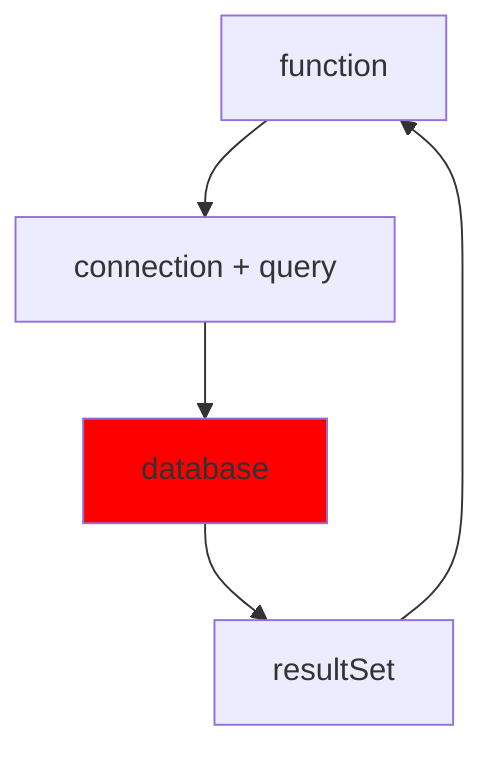
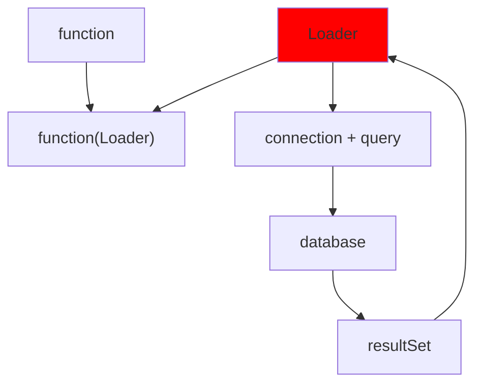

# Loaders and Savers

Approval Tests has the concept of a `Loader`. Whereas Mocks simulate an object and its functionality in a specific situation, a Loader is intended to permit tests to insert a testable seam into an otherwise untestable method. You can pass in a loader for that heavyweight operation that the method depends on.

**For example**: Let's say you have some code that access some data from a database. That code can be architected such that 



If you want to mock out the database, you have to mock out the:
1. database connection
1. query operator
1. resultSet

Alternatively, you could architect this with a `Loader` pattern.



With this architecture, you simply pass a `Loader` function as a parameter to the method
 replacing the specific call with a loader that would return the expected results for the test, 
 or the `Loader` that calls the original function to get the live results.

(Keep in mind, we're not testing the database functionality.
We can assume it works as expected.
We're only testing the method of interest.)

## Example
Let's see the workflow for adding a loader for testing purposes:

We want to test the following method:

<!-- snippet: step1 -->
<a id='snippet-step1'></a>
```java
public void sendOutSeniorDiscounts(DataBase database, MailServer mailServer)
{
  List<Customer> seniorCustomers = database.getSeniorCustomers();
  for (Customer customer : seniorCustomers)
  {
    Discount seniorDiscount = getSeniorDiscount();
    String message = generateDiscountMessage(customer, seniorDiscount);
    mailServer.sendMessage(customer, message);
  }
}
```
<sup><a href='/approvaltests-util-tests/src/test/java/com/spun/util/persistence/LoadersAndSaversExamplesTest.java#L60-L71' title='Snippet source file'>snippet source</a> | <a href='#snippet-step1' title='Start of snippet'>anchor</a></sup>
<!-- endSnippet -->

In this case, we want to replace the functions that use the DataBase object with Loaders :

## Step 1: Determine what we want to test
The first thing we need to do is to determine what the function in question returns in the case we want to test.
We start with the test:
<!-- snippet: step0 -->
<a id='snippet-step0'></a>
```java
@Test
public void senior_customer_list_includes_only_those_over_age_65()
{
  DataBase database = initializeDatabase();
  MailServer mailServer = initializeMailServer();
  sendOutSeniorDiscounts(database, mailServer);
  Approvals.verifyAll("", mailServer.getRecipients());
}
```
<sup><a href='/approvaltests-util-tests/src/test/java/com/spun/util/persistence/LoadersAndSaversExamplesTest.java#L12-L21' title='Snippet source file'>snippet source</a> | <a href='#snippet-step0' title='Start of snippet'>anchor</a></sup>
<!-- endSnippet -->

This test works against a live database with a live mail server.
We need to create full mocks for both (which is hard to do).

Instead, we will re-architect the code to use `Loaders` and `Savers`.
Also notice the method signature does not tell us what it wants out of the database,
only that it wants something from the database.

In this case we will want to replace the function that returns a list of senior customers. (FIX THIS)

## Step 2: Capture actual data
Now we dump the data resulting from a successful query so that we can create a fake object with its contents.
(Note: You may need to create a `toString()` method to make a readable data set)

<!-- snippet: step_capture_data -->
<a id='snippet-step_capture_data'></a>
```java
List<Customer> seniorCustomers = database.getSeniorCustomers();
seniorCustomers.stream().forEach(System.out::println);
```
<sup><a href='/approvaltests-util-tests/src/test/java/com/spun/util/persistence/LoadersAndSaversExamplesTest.java#L40-L43' title='Snippet source file'>snippet source</a> | <a href='#snippet-step_capture_data' title='Start of snippet'>anchor</a></sup>
<!-- endSnippet -->

generates

<!-- snippet: LoadersAndSaversExamplesTest.Step0_5.test_dump_data.approved.txt -->
<a id='snippet-LoadersAndSaversExamplesTest.Step0_5.test_dump_data.approved.txt'></a>
```txt
Bob, Jones, 123 Elm St., Tempe, AZ, 14-MAR-1958
Mary, Smith, 345 Oak St., Mason, VA, 04-MAY-1944
```
<sup><a href='/approvaltests-util-tests/src/test/java/com/spun/util/persistence/LoadersAndSaversExamplesTest.Step0_5.test_dump_data.approved.txt#L1-L2' title='Snippet source file'>snippet source</a> | <a href='#snippet-LoadersAndSaversExamplesTest.Step0_5.test_dump_data.approved.txt' title='Start of snippet'>anchor</a></sup>
<!-- endSnippet -->

Step 3: Create a result object populated with these values (or at least enough of them to ensure the function using the data will be properly exercised).

<!-- snippet: step_fake_data -->
<a id='snippet-step_fake_data'></a>
```java
List.of(new Customer("Bob, Jones, 123 Elm St., Tempe, AZ, 14-MAR-1958"),
    new Customer("Mary, Smith, 345 Oak St., Mason, VA, 04-MAY-1944"));
```
<sup><a href='/approvaltests-util-tests/src/test/java/com/spun/util/persistence/LoadersAndSaversExamplesTest.java#L51-L54' title='Snippet source file'>snippet source</a> | <a href='#snippet-step_fake_data' title='Start of snippet'>anchor</a></sup>
<!-- endSnippet -->

### Step 4: In the original method, replace the function call with a Loader
<!-- Snippet Compare: step1, step2 -->
<pre style="color: gray">
 public void sendOutSeniorDiscounts(DataBase database, MailServer mailServer) {
    List&lt;Customer> seniorCustomers = <b style="color: red">database.getSeniorCustomers(); </b>
    for (Customer customer : seniorCustomers) {
        Discount seniorDiscount = getSeniorDiscount();
        String message = generateDiscountMessage(customer, seniorDiscount);
        mailServer.sendMessage(customer, message);
    }
}
</pre>
# ⇓
<pre style="color: gray">
 public void sendOutSeniorDiscounts(DataBase database, MailServer mailServer) {
<b style="color: green">    Loader&lt;List&lt;Customer>> seniorCustomerLoader = () -> database.getSeniorCustomers(); </b>
    List&lt;Customer> seniorCustomers = <s style="color: red">database.getSeniorCustomers(); </s> <b style="color: green">seniorCustomerLoader.load(); </b>
    for (Customer customer : seniorCustomers) {
        Discount seniorDiscount = getSeniorDiscount();
        String message = generateDiscountMessage(customer, seniorDiscount);
        mailServer.sendMessage(customer, message);
    }
}
</pre>

Step 5: Now we introduce the new loader function as a parameter to the original function. (If you use the IDE's refactoring tools to do this it will save a lot of effort).

<!-- Snippet Compare: step2_b, step3_a, "extract method" -->

<pre style="color: gray">
        public void sendOutSeniorDiscounts(DataBase database, MailServer mailServer) {
            Loader&lt;List&lt;Customer>> seniorCustomerLoader = database::getSeniorCustomers;
            List&lt;Customer> seniorCustomers = seniorCustomerLoader.load();
            // ...
        }
</pre>
# ⇓ extract method
<pre style="color: gray">
        public void sendOutSeniorDiscounts(DataBase database, MailServer mailServer) {
            Loader&lt;List&lt;Customer>> seniorCustomerLoader = database::getSeniorCustomers;
<b style="color: green">            sendOutSeniorDiscounts(mailServer, seniorCustomerLoader); </b>
<b style="color: green">        } </b>
<b style="color: green">          </b>
<b style="color: green">        public void sendOutSeniorDiscounts(MailServer mailServer, Loader&lt;List&lt;Customer>> seniorCustomerLoader) { </b>
            List&lt;Customer> seniorCustomers = seniorCustomerLoader.load();
            // ...
        }
</pre>

Step 6: Update the unit tests to use the new Loader parameter.
We have now removed the reliance on the database to retrieve the data.
We still rely on a mail server to send the results.

<!-- Snippet Compare: step0, step0_b -->

<pre style="color: gray">
    @Test
    public void senior_customer_list_includes_only_those_over_age_65()
    {
<b style="color: red">      DataBase database = initializeDatabase(); </b>
      MailServer mailServer = initializeMailServer();
      sendOutSeniorDiscounts( mailServer, <b style="color: red">database </b>); 
      Approvals.verifyAll("", mailServer.getRecipients());
    }
</pre>
# ⇓
<pre style="color: gray">
    @Test
    public void senior_customer_list_includes_only_those_over_age_65()
    {
<s style="color: red">      DataBase database = initializeDatabase(); </s> 
<b style="color: green">      Loader&lt;List&lt;Customer>> mailingList = () -> List.of(new Customer("Bob"), new Customer("Mary"), new Customer("Tom")); </b>
      MailServer mailServer = initializeMailServer();
      sendOutSeniorDiscounts( mailServer, <s style="color: red">database </s> <b style="color: green">mailingList </b>); 
      Approvals.verifyAll("", mailServer.getRecipients());
    }
</pre>


Step 7: Now we can remove the DataBase as a parameter altogether.

public void sendOutSeniorDiscounts(DataBase database, MailServer mailServer, Loader&lt;List<Customer&gt;> seniorCustomerLoader) {

&nbsp;   List seniorCustomers = seniorCustomerLoader.load();

&nbsp;   // ...

}

becomes

public void sendOutSeniorDiscounts(MailServer, Loader&lt;List<Customer&gt;> seniorCustomerLoader) { ... }

and we can now remove that parameter from any function that calls this one - including our test.

This removes the dependency on the database for testing purposes.

Why not just use a mock object to do this?

Because mocking the object in question may require much more than what we are doing here. In this case we are simply replacing a call to a method with the result of that method - as if it were called. Defining a mock object would require more overhead and initialization.

But we still have a dependency on the MailServer in the example above.

Thanks for pointing that out! We'll now show how to solve that problem using a Saver.

Savers

Let's continue with the above example:

public void sendOutSeniorDiscounts(MailServer mailServer, Loader&lt;List<Customer&gt;> seniorCustomerLoader) {

&nbsp;   List seniorCustomers = seniorCustomerLoader.load();

&nbsp;   for (Customer customer : seniorCustomers) {

&nbsp;       Discount seniorDiscount = getSeniorDiscount();

&nbsp;       String message = generateDiscountMessage(customer, seniorDiscount);

&nbsp;       mailServer.sendMessage(customer, message);

&nbsp;   }

}

Here we're sending out an email message. But we don't really care if it gets sent, we just want to make sure it contains the information we expect. Replacing the MailServer object with a Saver is very similar to the process of introducing a Loader.

Step 1: Determine the function that we call to save (or in this case, send) the data.

public void sendOutSeniorDiscounts(MailServer mailServer, Loader&lt;List<Customer&gt;> seniorCustomerLoader) {

&nbsp;   List seniorCustomers = seniorCustomerLoader.load();

&nbsp;   for (Customer customer : seniorCustomers) {

&nbsp;       Discount seniorDiscount = getSeniorDiscount();

&nbsp;       String message = generateDiscountMessage(customer, seniorDiscount);

&nbsp;       **mailServer.sendMessage(new Email(customer, message));**

**mailSaver.save(new Email(customer, message));**

&nbsp;   }

Record Email(Customer customer, String message) {}

}

Step 2: Determine the data we want to test for its saved state. We start with a test. Unfortunately, since the MailServer is a “write-only” object, it’s hard to determine what’s being sent to it. The Saver gives us the ability to easily test for this state now.:

public void senior_customer_message_indicates_benefits_for_those_over_age_65() {

Stack&lt;Email&gt; sent = new Stack<>();

&nbsp;   List seniorCustomers = List.of(new Customer("Bob", "Jones", /\* ... /), / ... \*/);

&nbsp;   sendOutSeniorDiscounts(null, m -> sent.push(m), () -> seniorCustomers));

&nbsp;   Approvals.verifyAll(“Email”, sent);

}

Step 3: In the test, replace the object that does the saving with a Saver.

public void senior_customer_message_indicates_benefits_for_those_over_age_65() {

&nbsp;   TestMailServer mailServer = new TestMailServer();

&nbsp;   List seniorCustomers = List.of(new Customer("Bob", "Jones", /\* ... /), / ... \*/);

&nbsp;   sendOutSeniorDiscounts(null, () -> mailServer, () -> seniorCustomers));

&nbsp;   Approvals.verifyAll(mailServer.getMessage());

}

Class TestMailServer() {

&nbsp;     private String message;

&nbsp;     void sendMessage(Customer customer, String message) {

&nbsp;           this.message = message;

&nbsp;     }

&nbsp;     String getMessage() { return message; }

}

Step 4: In the original method, replace the function call that saves the data with a Saver.

mailServer.sendMessage(customer, message);

becomes

Saver&lt;Email&gt; mailSaver = e -> mailServer.sendMessage(e.customer, e.message);

mailSaver.save(new Email(customer, message)));

Step 5: Now we introduce the new saver function as a parameter to the original function. (If you use the IDE's refactoring tools to do this it will save a lot of effort).

public void sendOutSeniorDiscounts(MailServer mailServer, Loader&lt;List&gt; seniorCustomerLoader) {

&nbsp;       // ...

&nbsp;   ((Saver&lt;MailServer&gt;)() -> mailServer.sendMessage(customer, message)).save();

&nbsp;       // ...

}

becomes

public void sendOutSeniorDiscounts(MailServer mailServer, Saver&lt;MailServer&gt; mailServerSaver, Loader&lt;List&gt; seniorCustomerLoader) {

&nbsp;   // ...

&nbsp;   mailServerSaver.save();

&nbsp;   // ...

}

Step 6: Update the calls to this function to use the new Saver parameter.

public void senior_customer_list_includes_only_those_over_age_65() {

&nbsp;   TestMailServer mailServer = new TestMailServer();

&nbsp;   List seniorCustomers = List.of(new Customer("Bob", "Jones", /\* ... /), / ... \*/);

&nbsp;   sendOutSeniorDiscounts(null, () -> mailServer, () -> seniorCustomers));

&nbsp;   Approvals.verifyAll(mailServer.getRecipients());

}

Step 7: Now we can remove the MailServer as a parameter altogether.

public void sendOutSeniorDiscounts(MailServer mailServer, Saver&lt;MailServer&gt; mailServerSaver, Loader&lt;List&gt; seniorCustomerLoader) {

&nbsp;   // ...

&nbsp;   mailServerSaver.save();

&nbsp;   // ...

}

becomes

public void sendOutSeniorDiscounts(Saver&lt;MailServer&gt; mailServerSaver, Loader&lt;list&gt; seniorCustomerLoader) { ... }

and we can now remove that parameter from any function that calls this one - including our test.

This removes the dependency on the MailServer for testing purposes.

&nbsp;

&nbsp;
