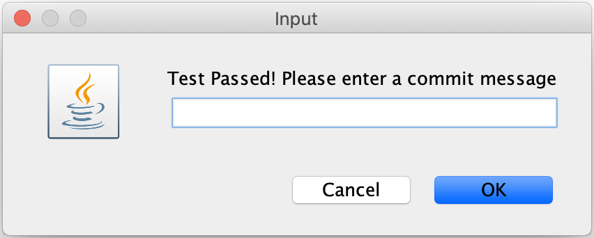

<!--
This file was generate by MarkdownSnippets.
Source File: /approvaltests/docs/mdsource/Features.source.md
To change this file edit the source file and then re-run the generation using either the dotnet global tool (https://github.com/SimonCropp/MarkdownSnippets#markdownsnippetstool) or using the api (https://github.com/SimonCropp/MarkdownSnippets#running-as-a-unit-test).
-->
<a id="top"></a>

# Features


<!-- START doctoc generated TOC please keep comment here to allow auto update -->
<!-- DON'T EDIT THIS SECTION, INSTEAD RE-RUN doctoc TO UPDATE -->
**Contents**

- [Test Commit Revert (TCR)](#test-commit-revert-tcr)
  - [Method 1 - extend class](#method-1---extend-class)
  - [Method 2 - use Runner](#method-2---use-runner)
  - [Results](#results)
  - [Usage](#usage)

<!-- END doctoc generated TOC please keep comment here to allow auto update -->

## Test Commit Revert (TCR)

This is a convenience class to follow the practice 'Test Commit/Revert' from Kent Beck. Simply adding
### Method 1 - extend class
<!-- snippet: test_commit_revert -->
```java
extends TestCommitRevertTest
```
<sup>[snippet source](/approvaltests/src/test/java/org/approvaltests/testcommitrevert/TestCommitRevertSample.java#L12-L14)</sup>
<!-- endsnippet -->
to your test class

### Method 2 - use Runner
<!-- snippet: test_commit_revert_runner -->
```java
@RunWith(TestCommitRevertRunner.class)
public class TestCommitRevertSample
```
<sup>[snippet source](/approvaltests/src/test/java/org/approvaltests/testcommitrevert/TestCommitRevertSample.java#L8-L11)</sup>
<!-- endsnippet -->
to annotate your class

### Results 

Whichever method you use, on test run TRC will invoke 1 of 2 options

*  On success
A dialog will appear asking for a commit message. Once given it will commit all files with that message


* On failure
It will revert all changes

Note: this currently only works with git

### Usage

Use this with caution. I find Test Commit/Revert helpful when doing a strict refactoring. It is unusable when creating approvaltests as the first run always fails and gets reverted.
Often I will have a test extend TCR for short periods then remove it after I'm out of a refactoring mode.

This also works well with [Arlo Belshee's Git Notation](https://github.com/RefactoringCombos/ArlosCommitNotation) 


---

[Back to User Guide](README.md#top)
