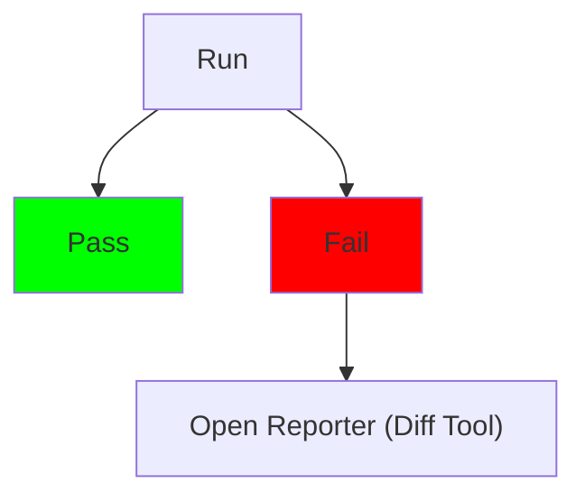
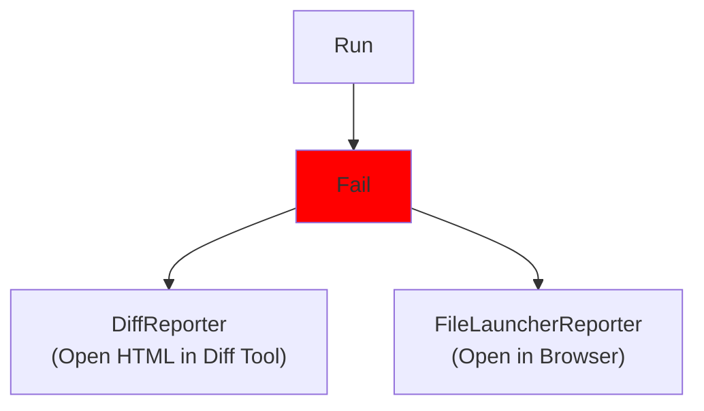

# Benefits of Different Reporters

## Feedback and Granularity

When your tests fail, ApprovalTests will open a reporter.
A reporter allows you to do many things.
The most common is to view the results in a diff tool.

There are many different diff tools that ApprovalTests automatically supports.
But there are other services reporters can perform, including: 
* Scripting
* Rendering
* Executing

## Scripting
The `ClipboardReporter` and `DelayedClipboardReporter` will automatically create a BASH script needed to approve the failing (or all of the failing) tests.
Using this reporter can make it easy to update hundreds of failures if you do a single thing that affects many tests.

## Rendering
Depending on what has changed you may want to look at your results in a different way.
For example, let's say we were working on an HTML page.
There are two ways you might want to view the results:
1. HTML text in a diff reporter. 
This is very helpful to find very detailed changes
2. Rendered in a browser.
This is very helpful when you want to know what the page actually looks like.

## Executing
This is a more advanced form of rendering.
For example, let's say you create a function that creates a piece of Java.
On failure, you would like to know if the Java compiles.
You might want to call a reporter that compiles the given Java code, and reports its success.
You do NOT want to do this when the test passes.

I have found executing reporters to be useful for:
* Linting and compiling
* SQL
* REST API calls
* Photos of rendered results (e.g.: this is what the page looks like on an iPhone 8, iPhone 13 Pro, and Android Galaxy)

For more on this please see [ExecutableCommands](../how_to/PatternsForTestingDataAccessAndRendering.md#the-executablecommand-interface).
