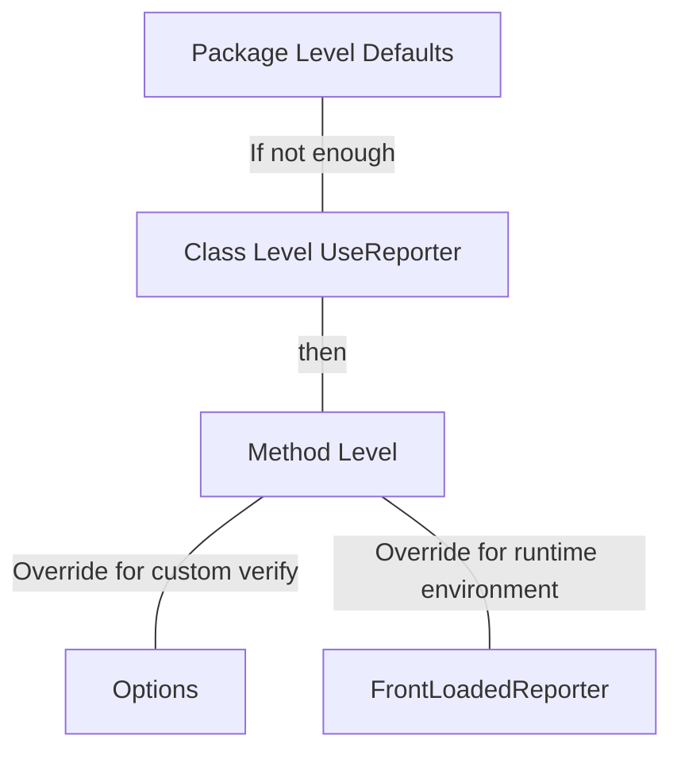

# Best Configuration Practices

toc

## How ApprovalTests selects a reporter
ApprovalTests uses the following mechanisms to select a reporter. The first one that works is the reporter that is selected.
1. Front-loaded Reporter
2. Options
3. UseReporter at the method level
4. UseReporter at the class level
5. UseReporter at the package level

## How to build your configuration

### 1. General Configuration
At the package level set the default reporter that you like the most.
See the [Reporters documentation](../Reporters.md#package-level).

### 2. Class level
If everything in a particular class violates the default reporter you can override it using the UseReporter annotation.
See the [Reporters documentation](../Reporters.md#class-and-method-level).

### 3. Method Level
If the specific method is violating the default reporter, override it, preferably using Options, or alternatively the UseReporter annotation.
See the [Reporters documentation](../Reporters.md#via-options).

### 4. Process Level
If you make a custom verify() method that should use an alternative reporter, override it in the Options.
See the [Reporters documentation](../Reporters.md#via-options).

### 5. Environmental Level
If you are in a situation where you need a different reporter based on the environment you are running in (for example, a CI machine, a continuous test runner, etc.) use a front-loaded reporter. This will override anything else that has been previously defined if the front-loaded reporter is valid for the environment.

