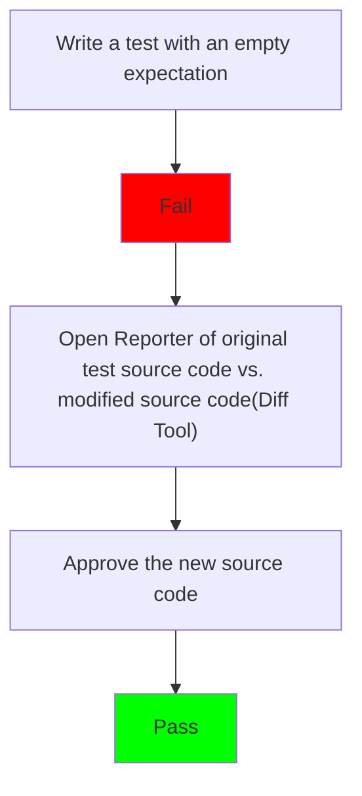

# Inline Approvals Workflow

<!-- toc -->
## Contents

  * [Feedback and Granularity](#feedback-and-granularity)
  * [Scripting](#scripting)
  * [Rendering](#rendering)
  * [Executing](#executing)<!-- endToc -->

## General flow

Inline approvals feel a lot like regular approvals except for the expected result is stored in the source in the test method, like a regular JUnit test.

## Step 1
Write the test with no expectation
snippet: inline_approvals_before

## Step 2 - Run and approve by diff
When you run this, a diff program will pop up.
But instead of showing just the approved and received, it will show you the original source code and the source code needed to approve the received result.
Here is an example:

You can approve this the same as normal: by moving the received from the left to the right.

## Step 3 - The resulting test file
The resulting test will have the approved text at the top of the test.
snippet: inline_approvals_after

## See also:
* [How to use inline approvals](../how_to/InlineApprovals.md)
