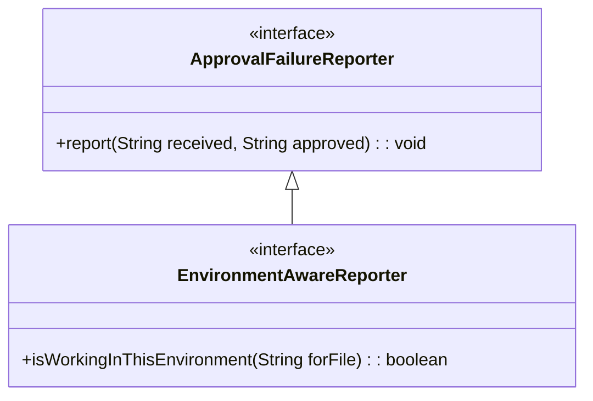
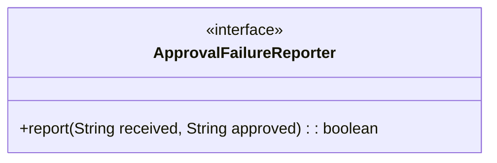

<a id="top"></a>
# Removing EnvironmentAwareReporter

toc 

Before October 2023 "ApprovalTests 19.0.0" and older versions used the following architecture:



This allowed us to use chain of responsibility to determine which Reporter to use.
The problem with `isWorkingInThisEnvironment` is that it is **predictive** but not **complete**.
It is saying that it should work in this environment but maybe something goes wrong when you actually do it.
Instead, we've combined this into



When you call report, the reporter now tells you if it worked.

**This change now brings ApprovalTests.Java in line with the architecture of other implementations (Python, C++, Swift).**

## How to upgrade

### Upgrading an EnvironmentAwareReporter

For an EnvironmentAwareReporter there are two things you have to do.
1. Change EnvironmentAwareReporter to ApprovalFailureReporter
2. Change the reporter:

```java

public boolean report(String received, String approved)
{
    if (!isWorkingInThisEnvironment(received))
    {
      return false;
    }
    // old reporter code here
    return true;
}
```

`isWorkingInThisEnvironment()` can be made private now usually or inlined.

### Upgrading an ApprovalFailureReporter 

* Add `return true;` to the end of your `report(String received, String approved)` method to satisfy the compiler.
