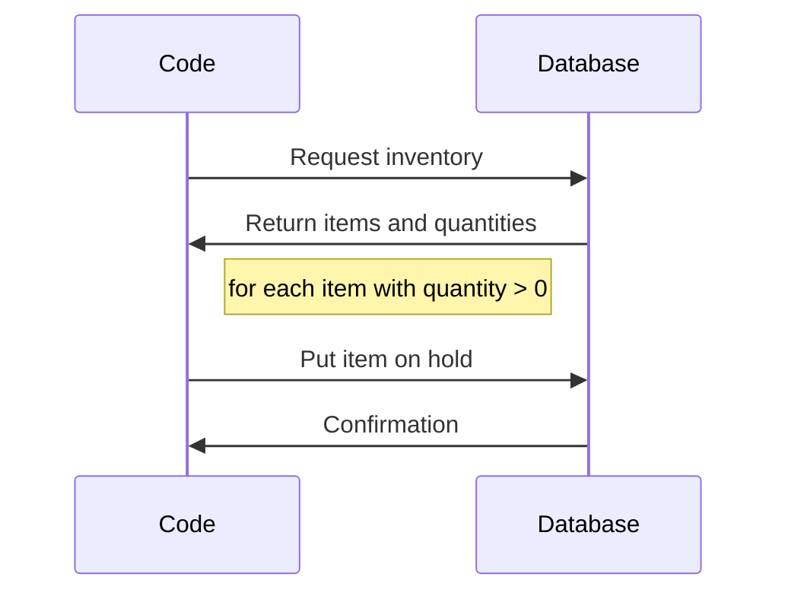

# How to encapsulate your database calls

<!-- toc -->
## Contents

  * [The problem](#the-problem)
  * [The scenario](#the-scenario)
  * [The solution](#the-solution)<!-- endToc -->

## The problem
I have a function call that I want to test, but it touches the database to both query and persist changes. This makes it very hard to test because I need to stand up a database to do anything with the function.

I want to restructure the function to make it easier to test.

## The scenario

In this scenario we have a function that takes a list of items you want to be held at a store and sets them aside for when you show up.
The sequence looks like this:

## The solution
