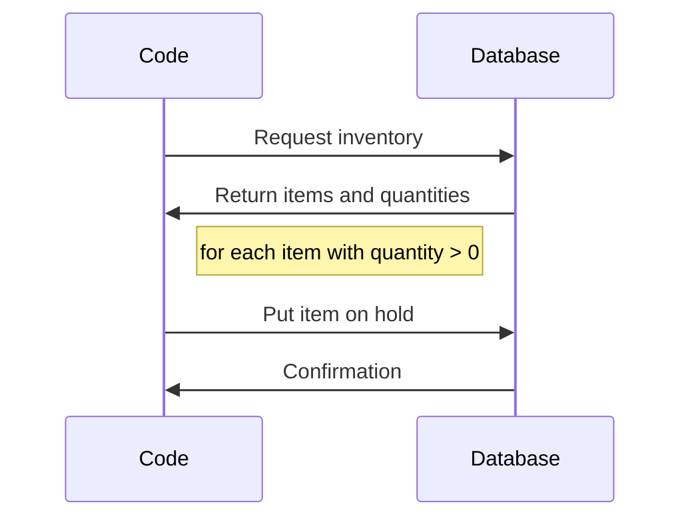

<a id="top"></a>

# How to Encapsulate Your Database Calls

<!-- toc -->
## Contents

  * [The problem](#the-problem)
  * [The scenario](#the-scenario)
    * [Starting Example](#starting-example)
    * [The solution](#the-solution)
    * [Why this is better](#why-this-is-better)
  * [Example Test](#example-test)<!-- endToc -->


## The problem
I have a function call that I want to test, but it touches the database to both query and persist changes. This makes it very hard to test because I need to stand up a database to do anything with the function.

I want to restructure the function to make it easier to test.

## The scenario

In this scenario we have a function that takes a list of items you want to be held at a store and sets them aside for when you show up.
The sequence looks like this:



### Starting Example
The code looks like:
<!-- snippet: separating_loaders_1 -->
<a id='snippet-separating_loaders_1'></a>
```java
public void reserveItems(List<String> ids)
{
  Item[] items = getInventory();
  for (Item item : items)
  {
    if (ids.contains(item.id) && item.inventoryCount > 0)
    {
      registerHold(item);
    }
  }
}
```
<sup><a href='/approvaltests-tests/src/test/java/org/approvaltests/demos/LoaderTest.java#L20-L32' title='Snippet source file'>snippet source</a> | <a href='#snippet-separating_loaders_1' title='Start of snippet'>anchor</a></sup>
<!-- endSnippet -->


### The solution

Refactor it to include loaders and savers
<!-- snippet: separating_loaders_2 -->
<a id='snippet-separating_loaders_2'></a>
```java
public void reserveItems(List<String> ids)
{
  reserveItems(ids, new InventoryLoader(), new ItemReserver());
}
public void reserveItems(List<String> ids, Loader<Item[]> loader, Saver<Item> itemReserver)
{
  Item[] items = loader.load();
  for (Item item : items)
  {
    if (ids.contains(item.id) && item.inventoryCount > 0)
    {
      itemReserver.save(item);
    }
  }
}
```
<sup><a href='/approvaltests-tests/src/test/java/org/approvaltests/demos/LoaderTest.java#L36-L52' title='Snippet source file'>snippet source</a> | <a href='#snippet-separating_loaders_2' title='Start of snippet'>anchor</a></sup>
<!-- endSnippet -->

### Why this is better

The solution here uses Loaders and Savers to allow for Dependency Injection (DI). The goal of DI is to make code more flexible, modular, and testable by removing hard-coded dependencies.

In the original code, the `reserveItems` method was directly tied to the database through the `getInventory` and `registerHold` methods. This means that any time you wanted to test this function, you would need a live database connection, which is not ideal for unit testing.

The refactored code, however, separates the responsibilities of loading inventory items and reserving them into separate components (`Loader` and `Saver` interfaces respectively). This allows the actual method of loading and saving items to be abstracted away from the `reserveItems` method itself.

The `reserveItems` method now takes in instances of Loader and Saver as parameters. In a live environment, these could be instances that interact with a live database. However, when unit testing, you can pass in fake instances of Loader and Saver (usually a lambda) removing the need for a live database connection during testing.

The end state improves testability, flexibility, and code management by removing direct database dependencies.

## Example Test

The resulting separation allows it to be easily tested.   
Here's how:

<!-- snippet: seperating_loaders_test -->
<a id='snippet-seperating_loaders_test'></a>
```java
@Test
public void testOnlyAvailableItemsAreReserved()
{
  Item milk = new Item("M101", "Milk", 2);
  Item missing_item = new Item("W202", "Item not Found", 2);
  Item sold_out_item = new Item("S303", "SuperPopularGame", 0);
  MockSaver<Item> saver = new MockSaver<>();
  List<String> reservedIds = Arrays.asList(milk.id, missing_item.id, sold_out_item.id);
  reserveItems(reservedIds, () -> new Item[]{milk, sold_out_item}, saver);
  // Only reserved milk
  Assert.assertArrayEquals(saver.saved.toArray(), new Item[]{milk});
}
```
<sup><a href='/approvaltests-tests/src/test/java/org/approvaltests/demos/LoaderTest.java#L53-L66' title='Snippet source file'>snippet source</a> | <a href='#snippet-seperating_loaders_test' title='Start of snippet'>anchor</a></sup>
<!-- endSnippet -->
