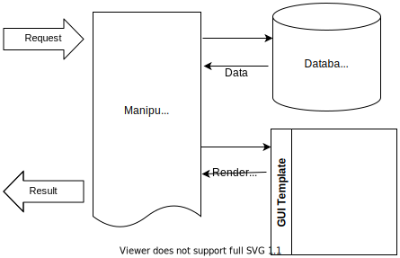
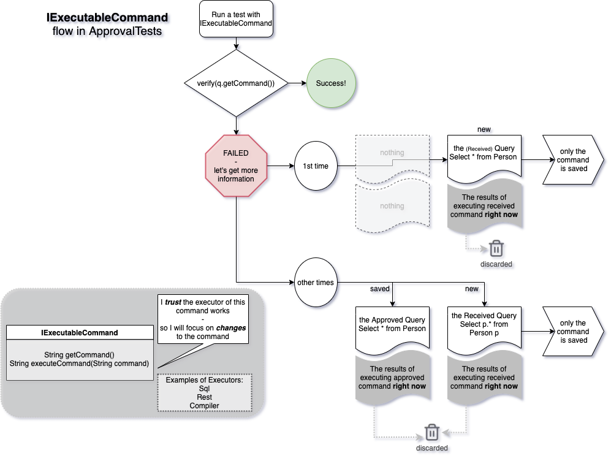

<a id="top"></a>

# How to separate and test data access and data rendering

<!-- toc -->
## Contents

  * [The problem](#the-problem)
  * [The scenario](#the-scenario)
  * [Schedule for Kitchen](#schedule-for-kitchen)
    * [01/02/2020](#01022020)
  * [Pattern #1: Separating the database](#pattern-1-separating-the-database)
    * [Summary](#summary)
  * [Pattern #2: Testing the loaders](#pattern-2-testing-the-loaders)
    * [The Test](#the-test)
    * [Testing Executable Commands](#testing-executable-commands)
      * [The ExecutableCommand interface](#the-executablecommand-interface)
      * [Testing Pattern](#testing-pattern)
        * [On First Failure](#on-first-failure)
        * [On Success](#on-success)
        * [On Subsequent Failure](#on-subsequent-failure)
      * [Making Loader Implement ExecutableCommand](#making-loader-implement-executablecommand)
        * [Making an adapter for your Loader](#making-an-adapter-for-your-loader)<!-- endToc -->


## The problem
Many programming tasks involve getting data from a data source, doing something with it,
and rendering the end result to a user. This pattern will show us how to separate those
pieces so they are all individually easy to test.

## The scenario
In our example scenario we are wanting to render the employee schedule for a restaurant.

Here is the basic architectural pattern:


When you request the schedule for a given day, you might get something that looks like:

 <!-- include: LoaderTest.testWithMockedData.approved.md -->
## Schedule for Kitchen
### 01/02/2020

| Person | Position | Start Time | 
| ---- | ------- | ------ |
| Scott | Chef | 5:00 PM |
| Llewellyn | Dishwasher | 6:30 PM |
<!-- endInclude -->

## Pattern #1: Separating the database

The method everyone uses is

<!-- snippet: entry_point_production -->
<a id='snippet-entry_point_production'></a>
```java
// Called by production code
public static String print(Calendar day)
```
<sup><a href='/approvaltests-util-tests/src/test/java/com/spun/util/persistence/KitchenScheduler.java#L11-L14' title='Snippet source file'>snippet source</a> | <a href='#snippet-entry_point_production' title='Start of snippet'>anchor</a></sup>
<!-- endSnippet -->

The problem with this is that it HAS to go to the database. If we test by going 
through the database we are doing an integration test where we want to do a unit test.
So we are going to split this method and wrap the part that gets the data into
a [loader](../../../approvaltests-util/docs/reference/LoadersAndSavers.md#top).
Once split, we will have a second method that looks like this:

<!-- snippet: entry_point_test -->
<a id='snippet-entry_point_test'></a>
```java
// Called by tests and the above function
public static String print(Loader<List<Shift>> shifts, Calendar day)
```
<sup><a href='/approvaltests-util-tests/src/test/java/com/spun/util/persistence/KitchenScheduler.java#L18-L21' title='Snippet source file'>snippet source</a> | <a href='#snippet-entry_point_test' title='Start of snippet'>anchor</a></sup>
<!-- endSnippet -->

The important part about this method is that it has no knowledge of a database.
Now we can call the remaining method and pass in a fake loader to mock the data. 
Here is a test that does that:

<!-- snippet: testing_rendered_data -->
<a id='snippet-testing_rendered_data'></a>
```java
void testWithMockedData()
{
  try (WithTimeZone tz = new WithTimeZone("PST"))
  {
    Calendar day = DateUtils.asCalendar(DateUtils.parse("2020/01/02"));
    // Mocked data
    MockLoader<List<Shift>> shifts = new MockLoader<>(
        Arrays.asList(new Shift("Scott", "Chef", DateUtils.setTime(day, 8, 0)),
            new Shift("Llewellyn", "Dishwasher", DateUtils.setTime(day, 9, 30))));
    verifyMarkdown(KitchenScheduler.print(shifts, day));
  }
}
```
<sup><a href='/approvaltests-util-tests/src/test/java/com/spun/util/persistence/LoaderTest.java#L22-L35' title='Snippet source file'>snippet source</a> | <a href='#snippet-testing_rendered_data' title='Start of snippet'>anchor</a></sup>
<!-- endSnippet -->

### Summary

1. Separate your method into a very small method that creates loaders and savers and calls ...
1. A method that takes the loaders and savers and does all the business logic
1. Ignore the first method and test the second method passing in fake (mock) data for your loaders and savers

## Pattern #2: Testing the loaders

### The Test

We will start by showing you the test. We will point out a couple of important things about it:

1. It is very small and simple
1. It does not require any setup of the database
1. It does not require a database (to pass)
1. Passing tests execute very quickly

<!-- snippet: testing_executable_command -->
<a id='snippet-testing_executable_command'></a>
```java
@Test
void testWithDatabaseAccess()
{
  try (WithTimeZone withTimeZone = new WithTimeZone())
  {
    Calendar day = DateUtils.asCalendar(DateUtils.parse("2020/01/02"));
    Approvals.verify(new LoadShiftsFromDatabase(day));
  }
}
```
<sup><a href='/approvaltests-util-tests/src/test/java/com/spun/util/persistence/LoaderTest.java#L41-L51' title='Snippet source file'>snippet source</a> | <a href='#snippet-testing_executable_command' title='Start of snippet'>anchor</a></sup>
<!-- endSnippet -->

### Testing Executable Commands

#### The ExecutableCommand interface

The reason the above test is so simple to write is because we have made our loader also implement an ExecutableCommand. Let's start with what an ExecutableCommand is:

<!-- snippet: ExecutableCommand.java -->
<a id='snippet-ExecutableCommand.java'></a>
```java
package com.spun.util.persistence;

public interface ExecutableCommand
{
  public String getCommand();
  public String executeCommand(String command);
}
```
<sup><a href='/approvaltests-util/src/main/java/com/spun/util/persistence/ExecutableCommand.java#L1-L7' title='Snippet source file'>snippet source</a> | <a href='#snippet-ExecutableCommand.java' title='Start of snippet'>anchor</a></sup>
<!-- endSnippet -->

As you can see an ExecutableCommand is a simple interface that allows you to **get a command** as a text string and allows you to **give a command** as text and also get a result as text.

While there are an unlimited amount of ExecutableCommands, three very common ones are:

1. SQL - can be executed against the database
1. REST - can be executed against a Web server
1. Code - can either be executed with an interpreter, or a compiled with a compiler

#### Testing Pattern



When we are testing an ExecutableCommand we are assuming that the executor of that command is stable. This assumption is based on two things:

1. They usually are
1. Even if they aren't they are out of our control

Because of this, we will focus only on the command and assume that if it worked before, the exact same command will work again. Therefore, for a test to pass, the only thing we need to know is that the command (that worked before) has not changed. Because of this, ApprovalTests does drastically different things on failure vs. success.

##### On First Failure

The first thing to note is that the nature of ApprovalTests is that the first test run always fails. This is because there is no *.approved file in the beginning. In this example, our ExecutableCommand is a SQL query. So when we run it the first time it will fail. It will give us the SQL query, but it will also execute that SQL query against a database. Which database? Usually we use production as queries are non-destructive and read-only. We will see what this query gives us in the moment from the production database. This is good evidence that the query worked, and if we like what we are seeing, we will approve only the query and throw away the query results from production.

##### On Success

If we run the test again, and the SQL is the same as th SQL that worked before, we do nothing. This means we do not need a database or a known state for the database. This makes it incredibly easy to run on CI.

##### On Subsequent Failure

If we change the SQL in the future, we want to see what the effects of that are on the database. So we will re-execute both the old and the new query against production once again. Regardless of where the results match, this test will fail. It is up to the programmer to decide if the new query is acceptable. If it is, the new query is replaced as the .approved file, and results of both the old and the new are thrown away. Because both queries are executed simultaneously, and the results are used only for the programmer to compare, there is no need to have a known state of your database.

#### Making Loader Implement ExecutableCommand

While it is possible to have your Loaders implement an ExecutableCommand, it is often more convenient to make an adapter.

##### Making an adapter for your Loader

Adapters are wrappers for an ExecutableCommand. As such, they have two pieces of responsibility:

1. Marshalling a command into a String
1. Marshalling a String back into a command
1. Executing the command and marshalling the results into a String format.

For example, let's say we have a PreparedStatement. It has both the SQL string, and the parameter values as objects. I might make a PreparedStatementAdapter that will extract the SQL and the parameters into JSON and give it back to me when I ask for the command. It will also know how to marshall the JSON object back into a PreparedStatement, make a database connection, and execute the statement. Finally, it knows how to take the results of that PreparedStatement and marshall it into a String that can be displayed to the user.
