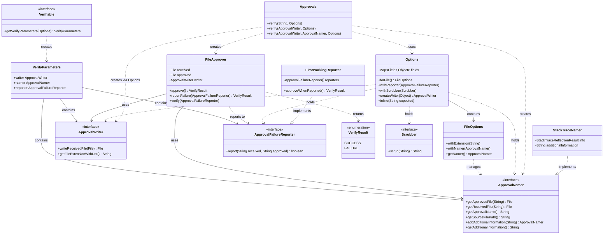
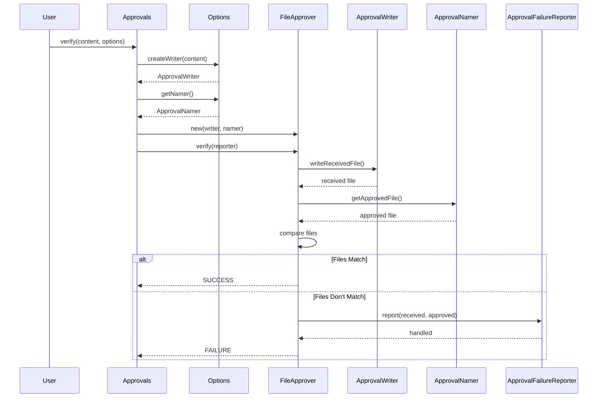

# ApprovalTests.Java Architecture

## Core Components Overview

## Approval Flow Sequence

## Key Architectural Patterns

### 1. **Options Pattern**
The `Options` class acts as a configuration object that bundles all the customizable aspects of the approval process:
- Reporter selection
- File naming strategy
- Content scrubbing
- Writer factory
- File extensions

### 2. **Strategy Pattern**
Multiple interfaces allow for pluggable implementations:
- `ApprovalFailureReporter` - Different ways to handle failures (IDE diff tools, auto-approve, etc.)
- `ApprovalNamer` - Different naming strategies (stack trace, custom, master directory)
- `ApprovalWriter` - Different ways to write output (text, image, JSON, etc.)
- `Scrubber` - Different content normalization strategies

### 3. **Chain of Responsibility**
`FirstWorkingReporter` implements a chain of reporters, trying each until one successfully handles the failure.

### 4. **Factory Pattern**
`Options.createWriter()` acts as a factory for creating appropriate writers based on the input type.

### 5. **Template Method**
The core verification flow in `FileApprover` follows a template:
1. Write received file
2. Get approved file
3. Compare
4. Report if failure

## Component Responsibilities

| Component | Primary Responsibility |
|-----------|----------------------|
| **Approvals** | Entry point, orchestrates the approval process |
| **Options** | Configuration and customization |
| **FileApprover** | Core comparison logic |
| **ApprovalWriter** | Serialization of objects to files |
| **ApprovalNamer** | File naming and location strategy |
| **ApprovalFailureReporter** | Failure handling and user feedback |
| **Scrubber** | Content normalization before comparison |
| **Verifiable** | Self-verifying objects |
| **VerifyResult** | Outcome of verification |
| **FirstWorkingReporter** | Composite reporter pattern |