# ApprovalTests Reporters UML Diagram

## Overview
This document contains a UML class diagram showing all reporter classes in the ApprovalTests.Java project and their relationships.

## Class Diagram

```mermaid
classDiagram
    %% Core Interfaces
    class ApprovalFailureReporter {
        <<interface>>
        +report(received String, approved String) boolean
    }
    
    class ReporterWithApprovalPower {
        <<interface>>
        +approveWhenReported() VerifyResult
    }
    
    class ApprovalReporterWithCleanUp {
        <<interface>>
        +cleanUp(received String, approved String) void
    }
    
    %% Inheritance relationship
    ReporterWithApprovalPower --|> ApprovalFailureReporter
    
    %% Abstract Base Classes
    class AbstractJUnitReporter {
        <<abstract>>
        -className String
        +assertEquals(expected String, actual String) void
    }
    
    class GenericDiffReporter {
        <<abstract>>
        #diffProgram String
        #arguments String
        #diffProgramNotFoundMessage String
        -validExtensions List~String~
    }
    
    %% Core Implementation Classes
    class MultiReporter {
        -reporters Collection~ApprovalFailureReporter~
    }
    
    class FirstWorkingReporter {
        -reporters ApprovalFailureReporter[]
        -approvalOutcome VerifyResult
    }
    
    class DefaultFrontLoadedReporter
    class EnvironmentVariableReporter
    
    %% Auto Approval Reporters
    class AutoApproveReporter
    class AutoApproveWhenEmptyReporter
    
    %% Clipboard Reporters
    class ClipboardReporter
    class DelayedClipboardReporter
    
    %% File Reporters
    class FileCaptureReporter
    class FileLauncherReporter
    
    %% Web Reporters
    class ImageWebReporter
    class TextWebReporter
    
    %% Test Framework Reporters
    class Junit3Reporter
    class Junit4Reporter
    class Junit5Reporter
    class JunitReporter
    class TestNgReporter
    class PitReporter
    
    %% Utility Reporters
    class QuietReporter
    class UseReporter
    class ReporterThatCreatesAnApprovalScript
    class InlineJavaReporter
    
    %% Diff Tool Reporters
    class DiffReporter
    class ImageReporter
    class BeyondCompareReporter
    class DiffMergeReporter
    class KDiff3Reporter
    class VisualStudioCodeReporter
    
    %% IntelliJ Reporters
    class IntelliJReporter
    class IntelliJCommunityReporter
    class IntelliJUltimateReporter
    class IntelliJMacSiliconReporter
    
    %% Platform-specific Reporters - Windows
    class BeyondCompareWindowsReporter
    class DiffMergeWindowsReporter
    class KDiff3WindowsReporter
    class P4MergeWindowsReporter
    class TortoiseDiffReporter
    class WinMergeReporter
    class WindowsDiffReporter
    
    %% Platform-specific Reporters - Mac
    class AraxisMergeReporter
    class BeyondCompareMacReporter
    class DiffMergeMacOsReporter
    class KDiff3MacReporter
    class KaleidoscopeDiffReporter
    class Kaleidoscope3DiffReporter
    class LegacyKaleidoscopeDiffReporter
    class MacDiffReporter
    class P4MergeReporter
    class TkDiffReporter
    class VisualStudioCodeReporter_Mac
    
    %% Platform-specific Reporters - Linux
    class DiffMergeLinuxReporter
    class KDiff3LinuxReporter
    class LinuxDiffReporter
    class MeldMergeReporter
    
    %% Relationships - Implementations
    AbstractJUnitReporter ..|> ApprovalFailureReporter
    GenericDiffReporter ..|> ApprovalFailureReporter
    MultiReporter ..|> ApprovalFailureReporter
    FirstWorkingReporter ..|> ReporterWithApprovalPower
    AutoApproveReporter ..|> ReporterWithApprovalPower
    AutoApproveWhenEmptyReporter ..|> ReporterWithApprovalPower
    ClipboardReporter ..|> ApprovalFailureReporter
    DelayedClipboardReporter ..|> ApprovalFailureReporter
    FileCaptureReporter ..|> ApprovalFailureReporter
    FileLauncherReporter ..|> ApprovalFailureReporter
    ImageWebReporter ..|> ApprovalFailureReporter
    TextWebReporter ..|> ApprovalFailureReporter
    QuietReporter ..|> ApprovalFailureReporter
    InlineJavaReporter ..|> ApprovalFailureReporter
    ReporterThatCreatesAnApprovalScript ..|> ApprovalFailureReporter
    DefaultFrontLoadedReporter ..|> ApprovalFailureReporter
    EnvironmentVariableReporter ..|> ApprovalFailureReporter
    
    %% Inheritance from AbstractJUnitReporter
    Junit3Reporter --|> AbstractJUnitReporter
    Junit4Reporter --|> AbstractJUnitReporter
    Junit5Reporter --|> AbstractJUnitReporter
    JunitReporter --|> AbstractJUnitReporter
    TestNgReporter --|> AbstractJUnitReporter
    PitReporter --|> AbstractJUnitReporter
    
    %% Inheritance from GenericDiffReporter
    DiffReporter --|> GenericDiffReporter
    ImageReporter --|> GenericDiffReporter
    BeyondCompareReporter --|> GenericDiffReporter
    DiffMergeReporter --|> GenericDiffReporter
    KDiff3Reporter --|> GenericDiffReporter
    VisualStudioCodeReporter --|> GenericDiffReporter
    IntelliJReporter --|> GenericDiffReporter
    IntelliJCommunityReporter --|> IntelliJReporter
    IntelliJUltimateReporter --|> IntelliJReporter
    IntelliJMacSiliconReporter --|> IntelliJReporter
    
    %% Windows Reporters
    BeyondCompareWindowsReporter --|> BeyondCompareReporter
    DiffMergeWindowsReporter --|> DiffMergeReporter
    KDiff3WindowsReporter --|> KDiff3Reporter
    P4MergeWindowsReporter --|> GenericDiffReporter
    TortoiseDiffReporter --|> GenericDiffReporter
    WinMergeReporter --|> GenericDiffReporter
    WindowsDiffReporter --|> FirstWorkingReporter
    
    %% Mac Reporters
    AraxisMergeReporter --|> GenericDiffReporter
    BeyondCompareMacReporter --|> BeyondCompareReporter
    DiffMergeMacOsReporter --|> DiffMergeReporter
    KDiff3MacReporter --|> KDiff3Reporter
    KaleidoscopeDiffReporter --|> GenericDiffReporter
    Kaleidoscope3DiffReporter --|> GenericDiffReporter
    LegacyKaleidoscopeDiffReporter --|> GenericDiffReporter
    MacDiffReporter --|> FirstWorkingReporter
    P4MergeReporter --|> GenericDiffReporter
    TkDiffReporter --|> GenericDiffReporter
    VisualStudioCodeReporter_Mac --|> VisualStudioCodeReporter
    
    %% Linux Reporters
    DiffMergeLinuxReporter --|> DiffMergeReporter
    KDiff3LinuxReporter --|> KDiff3Reporter
    LinuxDiffReporter --|> FirstWorkingReporter
    MeldMergeReporter --|> GenericDiffReporter
    
    %% Composition relationships
    MultiReporter o-- ApprovalFailureReporter : contains *
    FirstWorkingReporter o-- ApprovalFailureReporter : contains *
    DefaultFrontLoadedReporter o-- ApprovalFailureReporter : wraps 1
```

## Key Design Patterns

### 1. **Strategy Pattern**
The `ApprovalFailureReporter` interface defines the strategy for handling approval failures. Different concrete implementations provide various ways to report differences.

### 2. **Composite Pattern**
- `MultiReporter`: Aggregates multiple reporters and executes them all
- `FirstWorkingReporter`: Tries reporters in sequence until one works

### 3. **Template Method Pattern**
- `AbstractJUnitReporter`: Provides template for JUnit-based reporters
- `GenericDiffReporter`: Template for diff tool-based reporters

### 4. **Decorator Pattern**
- `DefaultFrontLoadedReporter`: Wraps another reporter with default behavior
- `DelayedClipboardReporter`: Adds delay functionality to clipboard reporting

## Reporter Categories

### Core Reporters
- **ApprovalFailureReporter**: Base interface for all reporters
- **ReporterWithApprovalPower**: Extended interface for reporters that can auto-approve
- **MultiReporter**: Runs multiple reporters
- **FirstWorkingReporter**: Tries reporters until one succeeds

### Test Framework Integration
- **JUnit Reporters**: Junit3Reporter, Junit4Reporter, Junit5Reporter, JunitReporter
- **TestNgReporter**: TestNG integration
- **PitReporter**: Mutation testing integration

### Diff Tool Reporters
- **Cross-platform**: DiffReporter, BeyondCompareReporter, DiffMergeReporter, KDiff3Reporter, VisualStudioCodeReporter
- **Platform-specific**: Separate implementations for Windows, Mac, and Linux

### Special Purpose Reporters
- **Auto-approval**: AutoApproveReporter, AutoApproveWhenEmptyReporter
- **Clipboard**: ClipboardReporter, DelayedClipboardReporter
- **Web**: ImageWebReporter, TextWebReporter
- **File**: FileCaptureReporter, FileLauncherReporter
- **Utility**: QuietReporter, InlineJavaReporter, ReporterThatCreatesAnApprovalScript

### IDE Integration
- **IntelliJ Family**: IntelliJReporter, IntelliJCommunityReporter, IntelliJUltimateReporter, IntelliJMacSiliconReporter
- **Visual Studio Code**: VisualStudioCodeReporter with platform-specific variants

## Usage Notes

1. **Reporter Selection**: The framework automatically selects appropriate reporters based on:
   - Operating system
   - Available diff tools
   - IDE environment
   - File types being compared

2. **Reporter Chaining**: Use `FirstWorkingReporter` or `MultiReporter` to combine multiple reporters for fallback or parallel execution.

3. **Custom Reporters**: Implement `ApprovalFailureReporter` interface to create custom reporting behavior.

4. **Auto-approval**: Use reporters implementing `ReporterWithApprovalPower` for automated approval workflows (use with caution in production).
